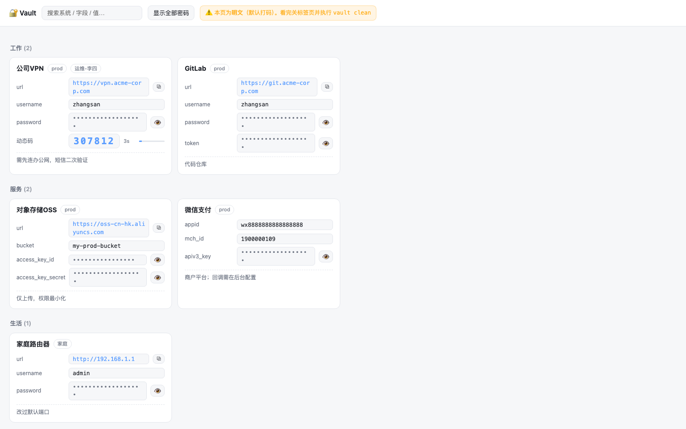

# sops-vault-kit

[English](README.md) | 中文

[](https://github.com/skyzhao1223/sops-vault-kit/actions/workflows/ci.yml)
[](LICENSE)

本地优先、**AI 可管理**的加密凭据库：一条 `install.sh` 得到一个
[sops](https://github.com/getsops/sops) + [age](https://age-encryption.org) + git 的库，
带 30 个命令的 CLI、浏览器卡片视图、TOTP 动态码、安全审计、离线密钥备份卡，以及一份内置的
`AGENTS.md`——它教会编码智能体如何操作这个库，而**永远接触不到你的明文密钥**。

无服务端、无云账号、无订阅。一切都在你磁盘上的一个加密文件里。

```sh
git clone https://github.com/skyzhao1223/sops-vault-kit && cd sops-vault-kit
./install.sh          # → ~/Vault：生成 age 密钥、git 初始化、vault 进 PATH
vault keycard         # 立刻打印你的离线密钥备份卡
```

## 截图

`vault html` —— 零依赖浏览器视图（分组卡片、默认打码、点击复制、TOTP 实时）：



威胁模型详见 [docs/threat-model.zh.md](docs/threat-model.zh.md)：防住什么、防不住什么、为什么这样取舍。

## 为什么又造一个库？

密码管理器（KeePassXC / Bitwarden / 1Password）存的是**给人看的二进制盒子**：不能 diff、没有
审计轨迹，让 AI 接入等于交出主密码。运维侧工具（HashiCorp Vault / Infisical）是**服务器**：
对个人凭据来说太重。

这个 kit 卡在两者中间，为 2026 年人们和编码智能体协作的真实方式而设计：

- **结构明文、值密文。** 白名单加密：除显式公开的字段（`url`/`appid`/`env`/`owner`/`note`…）
  外全部加密。AI（或你 `grep`）能看到完整目录——有哪些系统、谁负责、入口在哪——而密钥始终封存。
  新字段名**默认加密**：失败模式是"多加密"，绝不会静默漏成明文。
- **一次只解一个值。** `vault get` 按需解密单个字段。
- **git 就是审计轨迹。** 每次改动一个提交，`git log -p` 看得见何时改了什么，单条可回滚。
- **AI 操作规程随库发货。** `AGENTS.md` 直接落在你的库目录里：13 条纪律约束任何在此工作的
  编码智能体（绝不复述值、优先只用结构类命令、剪贴板四步协议、绝不碰 age 私钥……）。
  人/AI 边界写在智能体真正会读到的地方。

## 你会得到什么

| 类别 | 命令 |
| --- | --- |
| 浏览 | `vault ls` · `peek`（无需密钥）· `meta`（JSON 结构，免解密）· `search` · `find-secret`（反查某密钥用在哪些条目） |
| 取值 | `vault get` · `copy`（进剪贴板，不上屏）· `show` · `cat` / `view` / `html`（浏览器卡片视图，点击复制） |
| 写入 | `vault new`（自动生成 24 位随机密码）· `set`（值写 `-` 走 **stdin**）· `rm` · `edit`（VS Code 编辑整库） |
| TOTP | `vault totp`（RFC 6238，种子加密存储） |
| 安全 | `audit`（白名单/泄漏检查）· `shape`（**剪贴板体检**：长度/构成/前缀/sha256 指纹，绝不输出内容）· `doctor` |
| 生命周期 | `save`（git 提交）· `log` · `backup`（单文件 bundle，留 5 份）· `restore`（绝不覆盖，自动验证可解密）· `keycard`（可打印离线密钥卡，装了 `qrencode` 自动附二维码）· `reencrypt` · `clean` |
| 迁移 | `vault import dump.csv` —— Bitwarden / 1Password / Chrome / 通用 CSV 自动识别；已存在条目跳过，密钥值走 stdin（绝不进命令参数） |

### 剪贴板协议（`shape` 存在的理由）

剪贴板很混乱——你可能复制的是整行 `appkey: xxx`，或者带着看不见的空白。kit 的答案（同时也是
写给智能体的纪律）：

```sh
pbpaste | vault shape                        # ① 体检：只看形状+指纹，不看内容
pbpaste | vault set "服务/stripe" appkey -    # ② 值从剪贴板经管道直通加密文件
vault get "服务/stripe" appkey | tr -d '\n' | vault shape
                                             # ③ 指纹与①一致 → 写入校验通过
```

密钥全程不出现在命令行参数、shell 历史、进程列表、AI 对话记录里。

## 安全模型

| 资产 | 保护 |
| --- | --- |
| 密钥值 | sops AES-256-GCM 逐值加密；白名单模式（fail-closed） |
| 库文件 | 600 权限；加密 bundle 备份可放任何网盘 |
| age 私钥 | 600 权限、sops 平台默认位置、**永不离开本机**；`vault keycard` 生成纸质离线备份（唯一不可恢复的单点——务必做） |
| AI / 智能体 | 只见结构（`meta`/`ls`）；值只经剪贴板协议或用户明确操作；纪律由随库发货的 `AGENTS.md` 约束 |
| 删除 | git 历史保留密文值（设计如此——那就是你的回滚能力）；认为已暴露的密钥请轮换 |

如实说明的边界：以你的用户身份运行的本地进程能读库（所有本地密码存储的共同威胁模型，
FileVault 是你的朋友）；`vault html` 会在 `/tmp` 写一个 600 权限的明文页面，直到 `vault clean`。

## 文档

- [威胁模型](docs/threat-model.zh.md)（[English](docs/threat-model.md)）——防住什么、防不住什么、为什么这样取舍
- [迁移指南](docs/migration.md)——从 Bitwarden / 1Password / Chrome 导入
- [贡献指南](CONTRIBUTING.md)——仓库规则（bash 3.2、fail-closed、BSD+GNU 双方言）与发版流程

## 依赖与平台

- `sops`、`age`、`git`、`jq`、`python3`（macOS：`brew install sops age`）
- **macOS 优先**（原生 `pbcopy/pbpaste`、iCloud 默认备份目录）。**Linux 全功能**（CI 双平台实跑）：
  `vault copy` 自动回退 `wl-copy`/`xclip`/`xsel`；剪贴板协议里的 `pbpaste` 换成 `wl-paste` 或
  `xclip -o` 即可。Windows 走 WSL。
- Shell 补全：bash `source completions/vault.bash`；zsh 把 `completions/vault.zsh` 以 `_vault`
  放进 fpath。

## 配套

**[dsh-plugin-sops-vault](https://github.com/skyzhao1223/dsh-plugin-sops-vault)** ——
[DeepSeek Harness](https://github.com/deepseek-ai/deepseek-harness) 的侧边栏面板插件：
同一个库的 GUI 形态，且刻意不给模型注册任何工具。

## 许可

MIT © skyzhao1223
